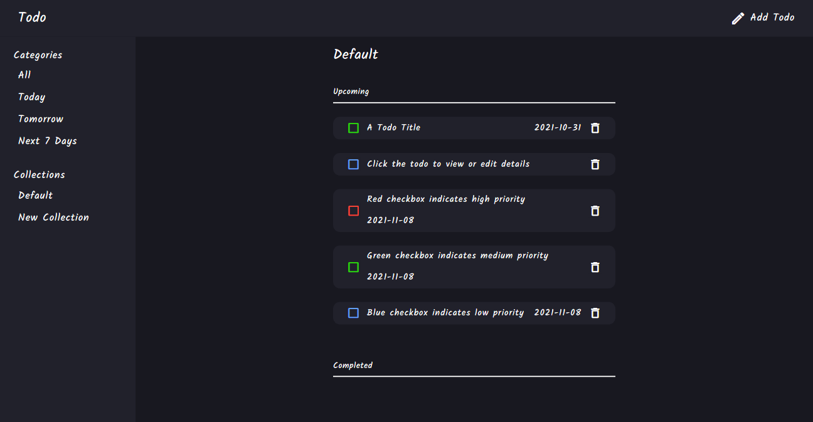

# Todo App

This is a web app where users can create todos, group under collections, edit and delete them.

[View Live Demo](https://peter-abah.github.io/tic-tac-toe)

## Table of contents

- [Overview](#overview)
  - [Features](#the-challenge)
  - [Screenshot](#screenshot)
- [My process](#my-process)
  - [Built with](#built-with)
- [Acknowledgments](#acknowledgments)

## Overview

### Features

Users can:

- Create a todo with title, description, due date and priority.
- Mark Todo as completed.
- Edit todo.
- Delete Todo.
- Create collection to group todo.
- Todos are saved in local storage.
- View Todos based on time created (today, tommorow and next 7 days).

### Screenshot

## My process

### Built with

- HTML
- CSS
- SASS
- JavaScript
- Webpack
- Handlebars

### What I learnt

- I used the project to practice OOP principles in JavaScript.
- I learnt about encapsulating various part of the code and to prevent tight coupling between objects in the code.
- I used the PubSub pattern for communication between various objects in the code.

## Acknowledgments
- [The Odin Project](https://www.theodinproject.com/paths/full-stack-ruby-on-rails/courses/javascript/lessons/todo-list)
